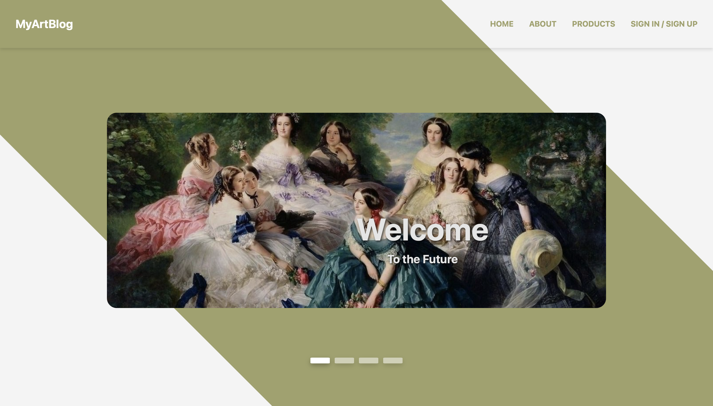
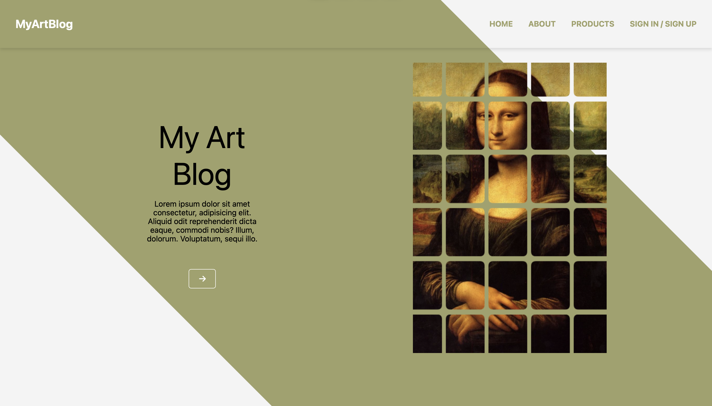
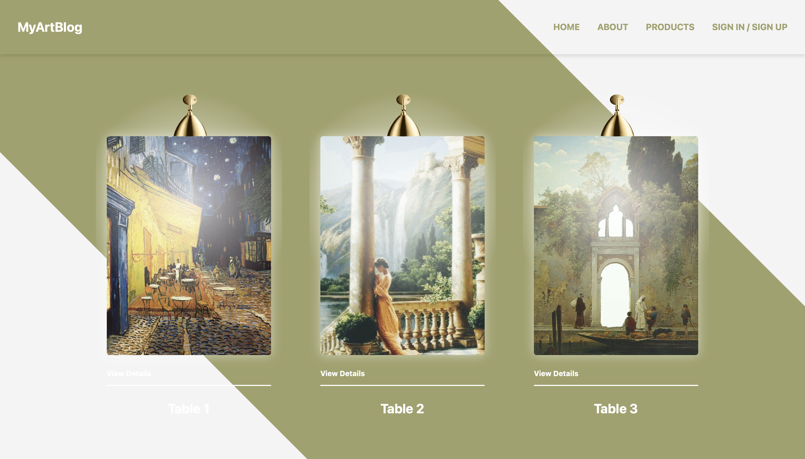

# Art Blog

This is a Next.js-based project built for an art blog platform that showcases creative content and artistic works with smooth animations and modern UI elements.

 
 
 


## Installation

To run this project locally, follow these steps:

1. Clone the repository:

    ```bash
    git clone https://github.com/isinsuatay/Nextjs-ArtBlog.git
    ```

2. Navigate into the project directory:

    ```bash
    cd art-blog
    ```

3. Install dependencies:

    ```bash
    npm install
    ```

4. Start the development server:

    ```bash
    npm run dev
    ```

The app will be running at `http://localhost:3000`.

## Scripts

- `dev`: Starts the development server on `localhost:3000`.
- `build`: Builds the project for production.
- `start`: Starts the Next.js server for production.
- `lint`: Runs the ESLint linter to check for code issues.

## Technologies Used

The following technologies and libraries were used in this project:

- **Next.js** (v14.2.12): A React framework for building fast and scalable web applications.
- **React** (v18): A JavaScript library for building user interfaces.
- **Framer Motion** (v11.5.6): For smooth animations and transitions.
- **Swiper** (v11.1.14): A modern slider library for creating touch sliders.
- **Styled Components** (v6.1.13): To write component-level styles using a CSS-in-JS approach.
- **SweetAlert2** (v11.14.1): To create beautiful, responsive, customizable pop-up boxes.
- **FontAwesome**: For adding scalable vector icons and social logos to your project.
  - `@fortawesome/free-solid-svg-icons` (v6.6.0)
  - `@fortawesome/react-fontawesome` (v0.2.2)
- **React Icons** (v5.3.0): For additional icon sets.
- **TypeScript** (v5): A strongly typed programming language that builds on JavaScript, giving you better tooling at any scale.

### Dev Dependencies

- **ESLint** (v8): A tool to identify and report on patterns found in ECMAScript/JavaScript code.
- **TypeScript Types**: Definitions for Node, React, and styled-components to ensure type safety and support in a TypeScript environment.

